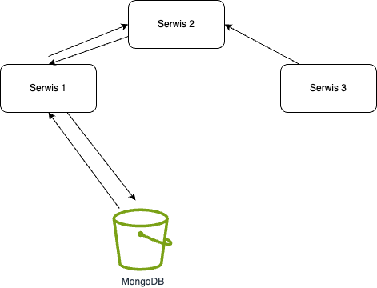

## eBPF powered Network Service and Security Observability for Kubernetes

### Autorzy:

- Jakub Cudak
- Piotr Aksamit
- Karol Jurzec
- Paweł Zaręba

### Rok: 2024
### Grupa: gr.5

## Spis treści

1. [Wprowadzenie](#wprowadzenie)
2. [Podstawy teoretyczne / Stos technologiczny](#podstawy-teoretyczne--stos-technologiczny)
3. [Opis koncepcji Case Study](#opis-koncepcji-case-study)

4. [Architektura rozwiązania](#architektura-rozwiązania)
5. [Opis konfiguracji środowiska](#opis-konfiguracji-środowiska)
6. [Metody instalacji](#metody-instalacji)
7. [Jak odtworzyć? - krok po kroku](#jak-odtworzyć---krok-po-kroku)
    - 7.1. Podejście infrastruktury jako kod
8. [Kroki wdrożenia demo](#kroki-wdrożenia-demo)
    - 8.1. Konfiguracja ustawień
    - 8.2. Przygotowanie danych
    - 8.3. Procedura wykonania
    - 8.4. Prezentacja wyników
9. [Podsumowanie - wnioski](#podsumowanie---wnioski)
10. [Źródła](#źródła)

## Wprowadzenie

Hubble to zaawansowane narzędzie do obserwacji i nadzoru bezpieczeństwa w sieci. Jest zaprojektowane specjalnie dla
środowiska Kubernetes i opiera swoje działanie na technologii eBPF (Extended Berkeley Packet Filter). To rozwiązanie
umożliwia pełną widoczność i śledzenie ruchu sieciowego w czasie rzeczywistym, oferując niezbędne informacje do
monitorowania wydajności, debugowania problemów oraz zapewniania bezpieczeństwa zwłaszcza w rozbudowanej sieci aplikacji
mikroserwisowych. Celem tej pracy jest zapoznanie się z technologią Hubble oraz zaprezentowanie jej możliwości na
przykładzie konkretnego zbioru serwisów działających w środowisku Kubernetes.

## Podstawy teoretyczne / Stos technologiczny
Projekt Hubble zapewnia zaawansowaną obserwowalność sieci oraz bezpieczeństwo w środowiskach Kubernetes, opierając się na technologii eBPF (Extended Berkeley Packet Filter). eBPF umożliwia wykonywanie programów w przestrzeni jądra Linuxa w sposób bezpieczny, co otwiera szerokie możliwości monitorowania i manipulowania ruchem sieciowym bez konieczności zmiany jądra systemu operacyjnego lub instalowania dodatkowych sterowników.
Podstawy teoretyczne działania Hubble:

- eBPF (Extended Berkeley Packet Filter):
        Bezpieczeństwo i Wydajność: eBPF jest nowoczesną technologią jądra Linuxa, która umożliwia uruchamianie skompilowanych programów w przestrzeni jądra, zapewniając wysoki poziom bezpieczeństwa i wydajności. Programy eBPF są wstępnie weryfikowane, aby zapobiec niepożądanym działaniom, takim jak zapętlenia nieskończone czy dostęp do nieprawidłowych obszarów pamięci.
        Obserwowalność i Śledzenie: Dzięki eBPF możliwe jest uzyskanie głębokiej wizualizacji zachowania systemu i aplikacji poprzez śledzenie wywołań systemowych, operacji na plikach, zdarzeń sieciowych i innych, bez negatywnego wpływu na wydajność systemu.
- Kubernetes Networking:
        Izolacja i Komunikacja: W środowiskach Kubernetes, Hubble wykorzystuje eBPF do monitorowania i analizy ruchu sieciowego między kontenerami, usługami i węzłami. Pozwala to na detekcję nieautoryzowanego ruchu, analizę wzorców ruchu i identyfikację potencjalnych zagrożeń.
        Polityki Sieciowe: Hubble może obserwować, jak ruch sieciowy odpowiada zdefiniowanym politykom sieciowym w Kubernetes, umożliwiając automatyczne egzekwowanie zasad bezpieczeństwa i izolacji między aplikacjami.

- Integracja z Cilium:
        Zarządzanie Siecią na Poziomie Aplikacji: Hubble jest często używany razem z Cilium, rozwiązaniem CNI (Container Network Interface) opartym na eBPF. Cilium zapewnia zarządzanie siecią na poziomie aplikacji, umożliwiając definiowanie polityk sieciowych, które są świadome kontekstu aplikacji.
        Rozszerzona Obserwowalność: Integracja z Cilium umożliwia Hubble monitorowanie ruchu na poziomie L7 (np. HTTP, gRPC), co jest kluczowe dla zrozumienia zachowania aplikacji i zapewnienia bezpieczeństwa na poziomie aplikacji.

- Wizualizacja i Analiza Danych:
        Graficzne Interfejsy Użytkownika i CLI: Hubble oferuje zarówno graficzne interfejsy użytkownika, jak i narzędzia CLI do wizualizacji i analizy danych sieciowych, umożliwiając szybkie identyfikowanie problemów i zagrożeń.
## Opis koncepcji Case Study

Usługi:
- 2 sewery mongo db
- 3 serwery w pythonie 
- Hubble 

Koncept:
Monitorowanie, obciążenie procesora, ramu poprzez ciąg odpytywanie bazy danych i innych serwerów. 

Serwery:
- serwer 1 wykonuje requesty za 10 miliekund na bazę A i bazę B 
- serwer 2 wykonuje requesty za 50 miliekund na bazę A i bazę B 
- serwer 3 wykonuje requesty za 100 miliekund na bazę A i bazę B Hubble

## Architektura rozwiązania

Zdecydowaliśmy się na analizę ruchu sieciowego w środowisku symulującym mikroserwisową aplikację uzywającą bazy danych MongoDB.
Architektura będzie wyglądała następująco:

Zrealizujemy 3 serwisy symulujące środowisko produkcyjne, które będą porozumiewać się ze sobą za pomocą protokołu http.
Serwisy zostaną zrealizowane w technologiach Python i/lub JavaScript.
Będą one generowały obciąenie rzędu kilku-kilkunastu zapytań na sekundę,
co pozwoli na satysfakcjonujące wyniki obserwacji.

W późniejszym stadium pracy mozemy wykonać migrację na klastrowy deployment mongodb (prawdopodobnie PSA),
w celu obserwacji komunikacji pomiędzy węzłami klastra bazodanowego.

## Opis konfiguracji środowiska

## Metody instalacji

## Jak odtworzyć? - krok po kroku

### Podejście infrastruktury jako kod

## Kroki wdrożenia demo

### Konfiguracja ustawień

### Przygotowanie danych

### Procedura wykonania

### Prezentacja wyników

## Podsumowanie - wnioski

## Źródła
